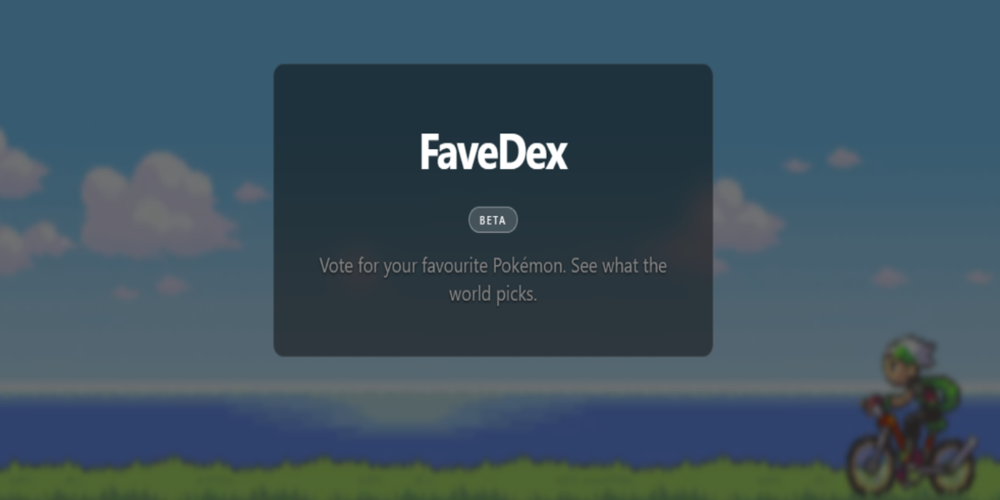
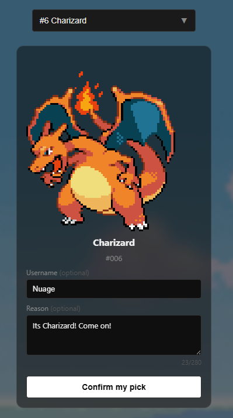
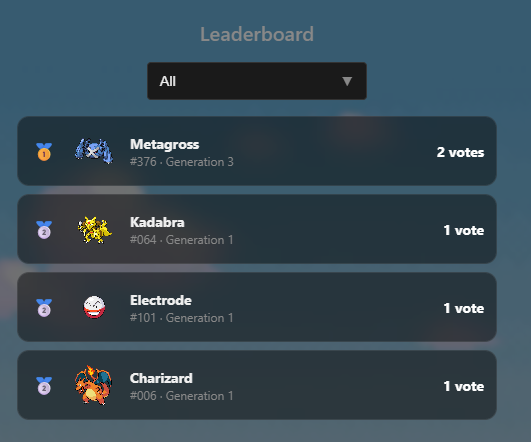
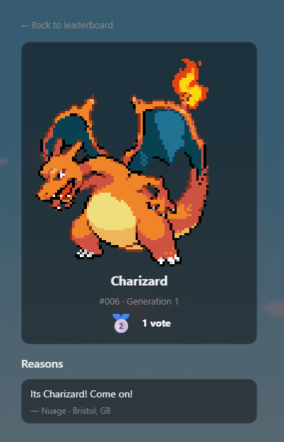

# FaveDex

**Vote for your favourite Pokémon. See what the world picks.**

## [favedex.vercel.app](https://favedex.vercel.app)

  

---

## What is it?

FaveDex is a live, vote-based popularity tracker for all 1025 National Dex Pokémon, including regional variants, alternate forms, Mega Evolutions, and more! Every vote is tagged with your location to build a real-time picture of the world's favourite Pokémon, along with usernames and their reasons why. The leaderboard updates in real time, filtered by generation, ranked with medals, with tied entries handled Olympic-style.

Each Pokémon has its own profile page showing total votes, leaderboard rank, and every reason people left, newest first with relative timestamps.

Regional variants and alternate forms (Alolan, Galarian, Hisuian, Paldean, Mega, Gigantamax, and more) are tracked as separate entries with their own vote counts, leaderboard positions, and profile pages.

---

## Workflow

| Vote | Leaderboard | Profile |
|:---:|:---:|:---:|
|  |  |  |

1. Search for a Pokémon by name
2. Optionally add a username and reason (up to 280 characters)
3. Allow or skip location. Your coordinates are reverse-geocoded to city and country client-side before submission
4. Hit confirm: Your vote is submitted to a Vercel Edge Function, rate-limited by IP, and inserted into Supabase
5. View the live leaderboard or your Pokémon's profile page

---

## Architecture

Votes flow through a Vercel Edge Function (`/api/vote`) rather than hitting Supabase directly from the client. The edge function handles input validation, sanitisation, and IP-based rate limiting (one vote per IP per day), then inserts using the Supabase service key server-side. The client only holds the publishable key, used for read-only leaderboard and profile queries (protected by Row Level Security policies on the `votes` table).

Browser → POST /api/vote (Edge Function)
├── Validate + sanitise input
├── Rate limit by IP + date
└── Insert via service key → Supabase (Postgres + RLS)

Browser → GET supabase/votes (publishable key, RLS read-only)

---

## Tech Stack

- **Frontend** — React, Vite
- **Backend** — Supabase (Postgres + RLS), Vercel Edge Functions
- **Sprites** — PokeAPI CDN (animated Gen 1–5, static beyond), local icon sprites for combobox
- **Geocoding** — Nominatim (OpenStreetMap)

---

## Features

- Vote for any of the 1025 National Dex Pokémon, including regional variants, alternate forms, Mega Evolutions, and more
- Regional variants and alternate forms tracked as separate leaderboard entries
- Searchable combobox with natural language search ("alolan vulpix", "mega charizard y")
- Votes tagged by city and country via reverse geocoding
- Live leaderboard with generation filter, name search, medal rankings, and tied-rank support
- URL-persisted filter state back navigation restores your search and generation filter
- Pokémon profile pages showing vote count, rank, reasons, and relative timestamps
- Glassmorphism UI with animated Gen 3 video background and dark mode toggle
- Fully mobile responsive with iOS autoplay support
- Server-side IP rate limiting via Vercel Edge Functions
- 404 page (feat. Psyduck)

---

## Roadmap

- [x] Vote submission with username and reason
- [x] Reverse geocoding to city and country
- [x] Cookie + server-side IP rate limiting
- [x] Live leaderboard with generation filter, name search, and medal rankings
- [x] Pokémon profile pages with vote reasons and relative timestamps
- [x] Regional variants and alternate forms as separate entries
- [x] Glassmorphism UI with video background and dark mode toggle
- [x] Mobile responsive with iOS video autoplay fix
- [x] Deployed on Vercel with Supabase backend
- [ ] Heart reacts on reasons
- [ ] World map view of votes by location
- [ ] Manual location input
- [ ] Custom domain (nuagespc.com)

---

## Part of Nuage's PC

FaveDex is part of Nuage's PC, currently in development. A hub for Pokémon fan projects such as GlitchMon and Shiny Hunt Sim.

---

*Built by [nuageuk](https://github.com/nuageuk)*