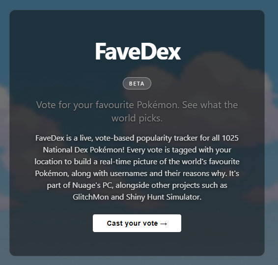

# FaveDex

**Vote for your favourite Pokémon. See what the world picks.**

FaveDex is a live, vote-based popularity tracker for all 1025 National Dex Pokémon. Every vote is tagged with your location to build a real-time picture of the world's favourite Pokémon, complete with usernames and reasons why.

[favedex.vercel.app](https://favedex.vercel.app)

---

## Features

- Vote for any of the 1025 National Dex Pokémon once per day
- Votes tagged by city and country via reverse geocoding
- Live leaderboard with generation filter, medal rankings, and tied-rank support
- Pokémon profile pages showing vote reasons and usernames
- Glassmorphism UI with animated Gen 3 video background and dark mode toggle
- Fully mobile responsive
- Server-side IP rate limiting via Vercel Edge Functions

## Tech Stack

- **Frontend** — React, Vite
- **Backend** — Supabase (Postgres + RLS), Vercel Edge Functions
- **Sprites** — PokeAPI CDN (animated Gen 1–5, static beyond)
- **Geocoding** — Nominatim (OpenStreetMap)

## Architecture

Votes are submitted via a Vercel Edge Function (`/api/vote`) which handles input validation, IP-based rate limiting, and insertion using the Supabase service key — keeping privileged credentials server-side only. The client uses the publishable key for read-only leaderboard and profile queries, protected by Row Level Security.

## Part of Nuage's PC

FaveDex is part of [Nuage's PC](https://favedex.vercel.app), a hub for Pokémon fan projects alongside GlitchMon and Shiny Hunt Simulator.

---

*Built by [nuageuk](https://github.com/nuageuk)*